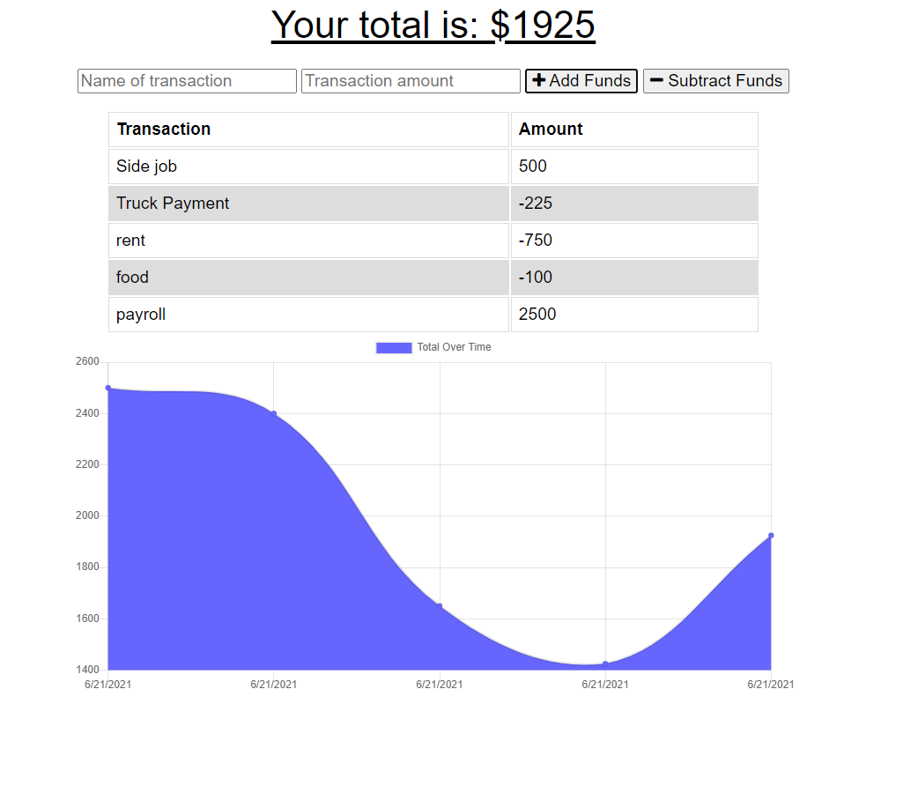

# progressive-budget

## Description
This is a simple application to keep track of a budget both online and offline. It was a good exercise in setting up offline functionality as well as reinforcing the skills I've developed in full stack deployment.

## Table of Contents (Optional)

- [Usage](#usage)
- [Credits](#credits)
- [License](#license)

## Usage
To use the app simply visit: https://sheltered-tundra-23663.herokuapp.com/    
      
    

## Credits

#### Collaborators
- Andrew Tirpok
- Nick Strong
- Zach Wahrer

#### Tech Used
- AtlasDB
- Heroku
- Express
- Mongoose
- Morgan
- Compression

## License
MIT License

Copyright (c) [2021] [TJ Courey]

Permission is hereby granted, free of charge, to any person obtaining a copy
of this software and associated documentation files (the "Software"), to deal
in the Software without restriction, including without limitation the rights
to use, copy, modify, merge, publish, distribute, sublicense, and/or sell
copies of the Software, and to permit persons to whom the Software is
furnished to do so, subject to the following conditions:

The above copyright notice and this permission notice shall be included in all
copies or substantial portions of the Software.

THE SOFTWARE IS PROVIDED "AS IS", WITHOUT WARRANTY OF ANY KIND, EXPRESS OR
IMPLIED, INCLUDING BUT NOT LIMITED TO THE WARRANTIES OF MERCHANTABILITY,
FITNESS FOR A PARTICULAR PURPOSE AND NONINFRINGEMENT. IN NO EVENT SHALL THE
AUTHORS OR COPYRIGHT HOLDERS BE LIABLE FOR ANY CLAIM, DAMAGES OR OTHER
LIABILITY, WHETHER IN AN ACTION OF CONTRACT, TORT OR OTHERWISE, ARISING FROM,
OUT OF OR IN CONNECTION WITH THE SOFTWARE OR THE USE OR OTHER DEALINGS IN THE
SOFTWARE.  

## Badges

## Features
- Online/Offline functionality
- Add/Remove funds
- Built in graphing function for ease of use 

## How to Contribute
No contribution necessary but feedback is welcome. Contact me on GitHub or at tjcourey84@gmail.com